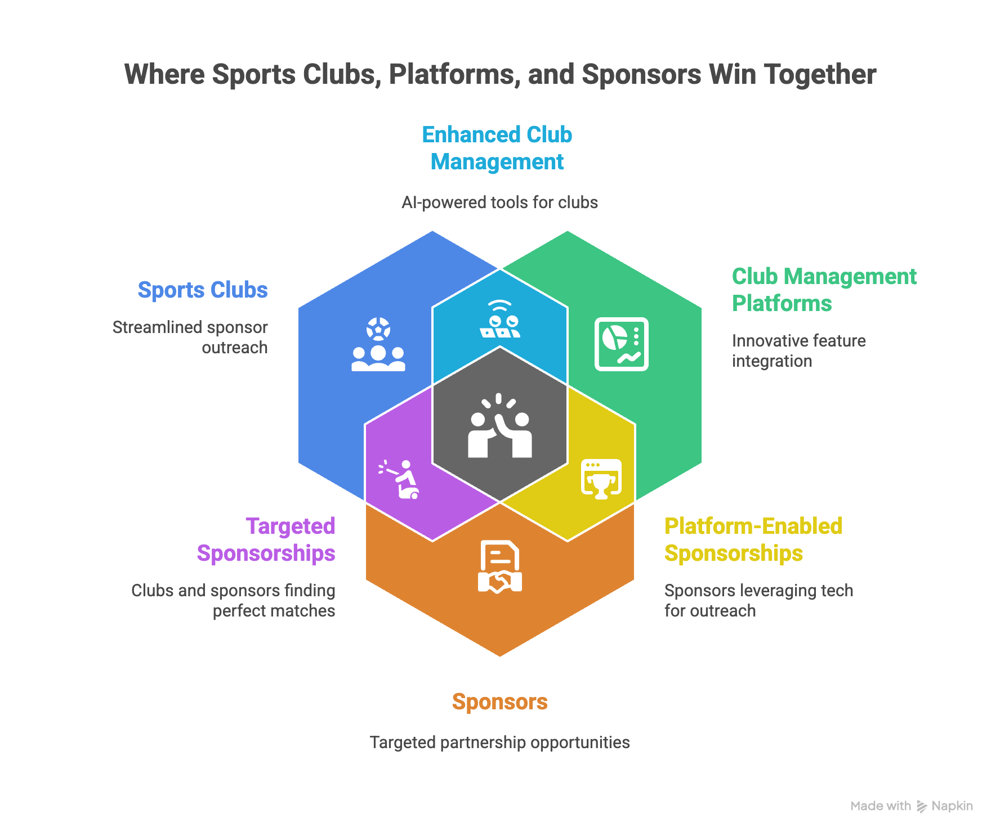
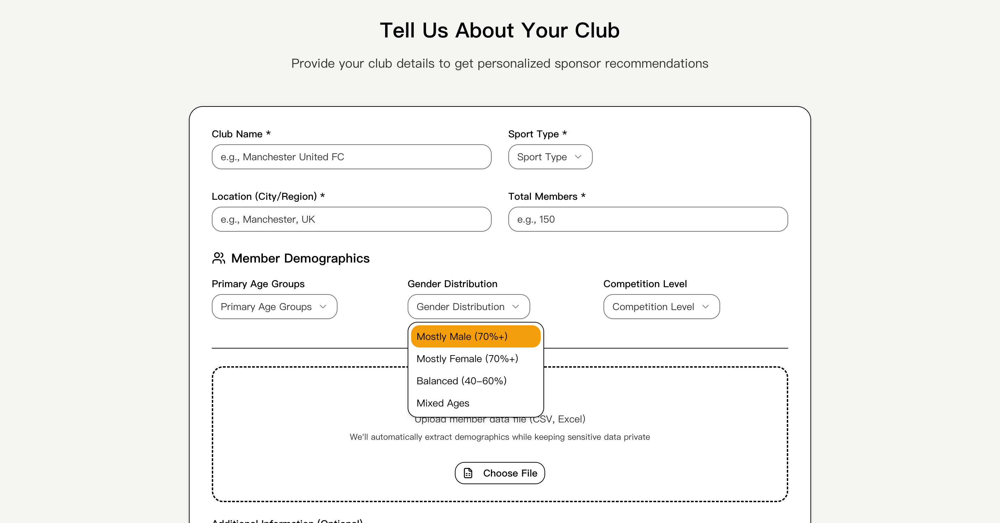
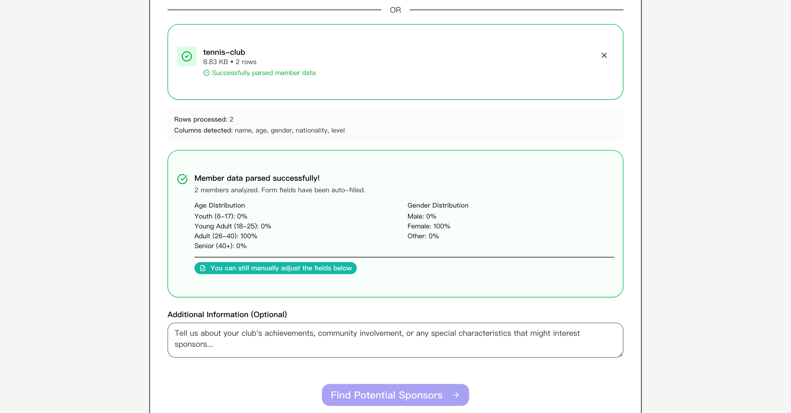
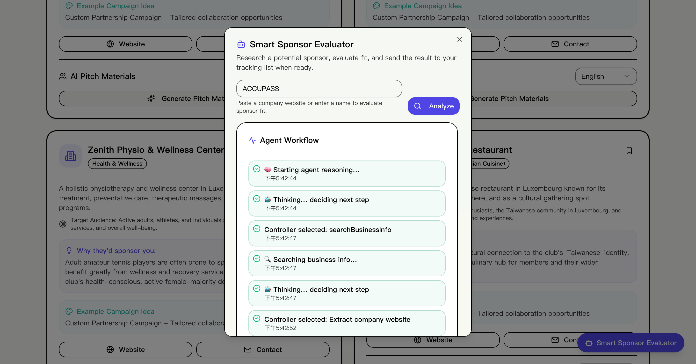
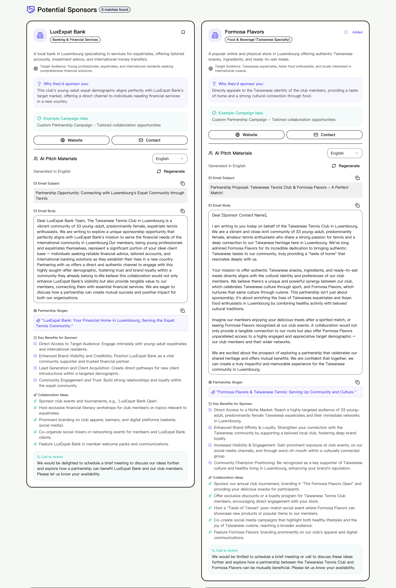
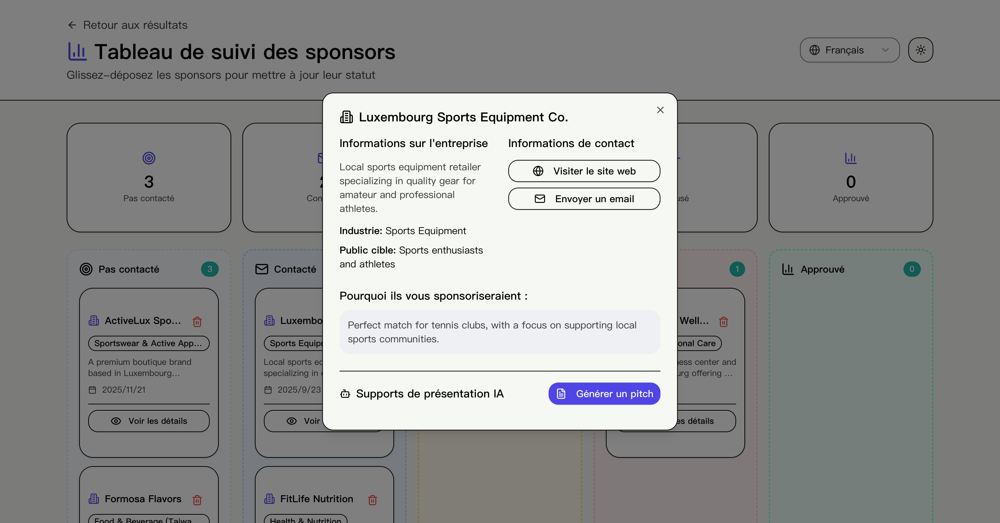
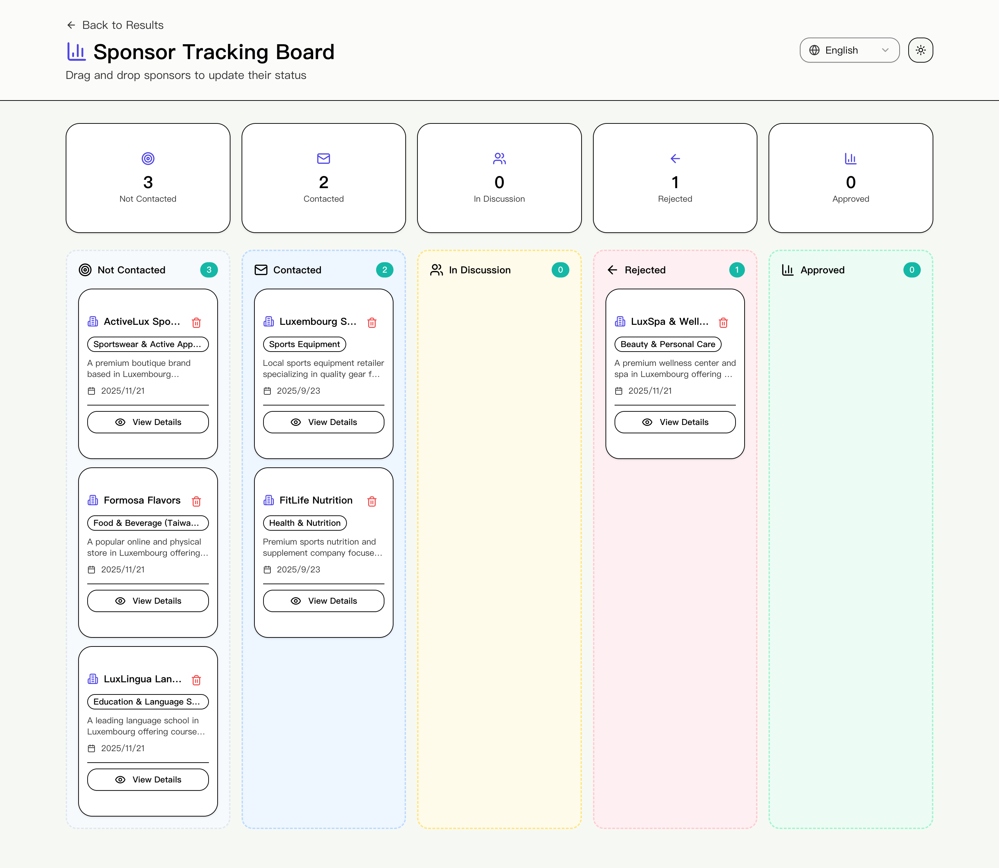
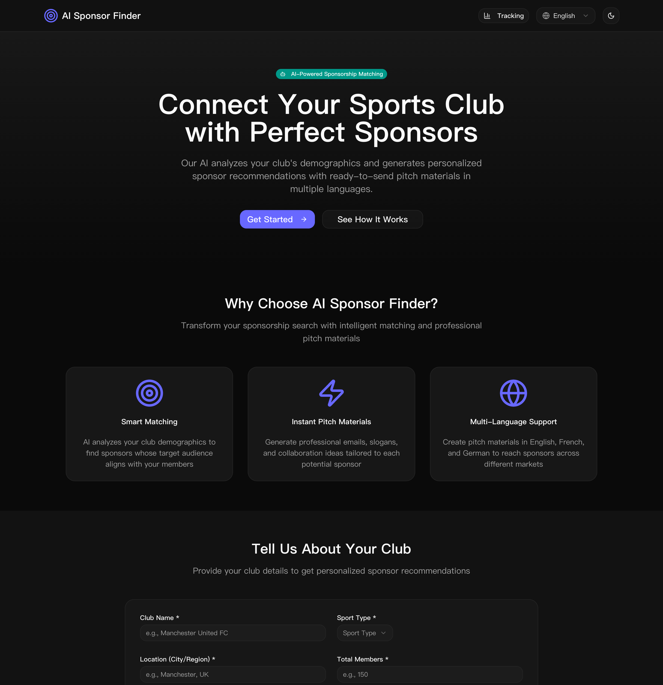

# AI Sponsor Finder

<div align="center">

**Connect Sports Clubs with Perfect Sponsors Through Intelligent AI Matching**

[](https://v0-ai-sponsor-finder.vercel.app/)
[](https://v0.app/chat/projects/8JeRrcgC6Ed)
[](https://nextjs.org/)
[](https://www.typescriptlang.org/)
[](https://ai.google.dev/)

</div>

### 🚀 Try It Now

Experience AI Sponsor Finder live: **[Launch the Demo](https://v0-ai-sponsor-finder.vercel.app/)**.

---

## Table of Contents

- [Overview](#overview)
- [Key Features](#key-features)
- [Technology Stack](#technology-stack)
- [Getting Started](#getting-started)
  - [Prerequisites](#prerequisites)
  - [Installation](#installation)
  - [Configuration](#configuration)
  - [Running Locally](#running-locally)
- [Testing (Built with Codex)](#testing-built-with-codex)
- [Project Structure](#project-structure)
- [Future Enhancements](#future-enhancements)

---

## Overview

**AI Sponsor Finder** is an intelligent web application that revolutionizes how sports clubs connect with potential sponsors. By leveraging AI-powered demographic analysis and natural language generation, it matches clubs with relevant sponsors and automatically generates personalized pitch materials in multiple languages.

The latest build now includes a **Smart Sponsor Evaluator agent**: paste a company URL or name and the controller LLM decides, step by step, whether to parse the website, run a search, extract a profile, or score sponsor fit—surfacing a fully explainable workflow along the way. It’s an opinionated concept rather than a full autonomous agent (no long-term memory or background jobs), but it demonstrates how tool-use and controller prompts can make sponsor research feel interactive.

### The Problem It Solves

Finding the right sponsors is challenging for sports clubs:

- **Time-consuming research** to identify relevant sponsors
- **Manual pitch creation** for each potential partner
- **Language barriers** when targeting international sponsors
- **Difficulty tracking** outreach progress across multiple prospects

### The Three-Win Solution

This application creates value for all stakeholders:

1. **For Sports Clubs** 🏆

   - Save time with AI-powered sponsor matching
   - Get professional pitch materials instantly
   - Track outreach pipeline efficiently
   - Reach international sponsors with multi-language support

2. **For Club Management Platforms (like Clubee)** 💼

   - Showcase potential AI-powered features
   - Add value to existing club management offerings
   - Demonstrate innovation in sports tech
   - Create new revenue opportunities

3. **For Sponsors** 🤝
   - Connect with clubs that align with their brand values
   - Receive well-researched, targeted partnership proposals
   - Discover opportunities matching their target demographics
   - Build authentic community relationships


_Visual summary showing how clubs, platforms, and sponsors each benefit from the same workflow_

---

## Key Features

### 📝 Guided Club Onboarding

- **Intuitive Form Inputs**: Capture club name, sport, demographics, and outreach goals through a clean multi-section form with inline hints.
- **CSV/Excel Import**: Upload up to 5MB of roster data; the parser auto-detects headers, calculates ages, and aggregates gender splits.
- **Smart Defaults**: Parsed insights flow directly into the form so clubs can tweak and submit within seconds.
- **Review & Confirm**: Preview the extracted stats before committing them to the profile.


_Guided form collects every detail needed to personalize sponsor matches_


_Drop in a spreadsheet and instantly convert member data into demographics_

### 🎯 Precision Sponsor Intelligence

- **Audience Alignment**: Analyzes club demographics (age distribution, gender split, location, sport type) to identify compatible sponsors.
- **Industry Recommendations**: Suggests relevant sponsorship industries based on club profile.
- **Transparent Reasoning**: Explains why each sponsor would be a good fit for your specific club.


_AI analyzes your club demographics to find perfectly matched sponsors_

### 🧠 Smart Sponsor Evaluator Agent

- **URL or Name Input**: Paste a company website or type its name—the evaluator auto-detects URLs, prioritizes them as the ground truth, and still supports traditional search when no link is provided.
- **Adaptive Controller Loop**: A Gemini-powered controller inspects state after every step, then decides which capability to trigger next—website understanding, business info search, profile extraction, fit scoring, or finishing—never following a fixed sequence.
- **Single-Pass Decisions**: Each capability runs at most once, eliminating brittle retry loops while keeping the workflow transparent.
- **Insightful Logs**: Localized timeline surfaces each controller decision (“Extract company website”, “Score sponsor fit”, etc.) so club managers can see exactly how the recommendation came together before adding it to tracking.


_Controller walks through search, profile extraction, and fit scoring for a typed-in company_


_URL-first run shows the agent extracting the site, building the profile, then finishing in one pass_

### 🤖 AI-Generated Pitch Materials

- **Email Templates**: Professional, customized sponsorship inquiry emails
- **Compelling Slogans**: Partnership taglines that resonate
- **Collaboration Ideas**: Creative partnership concepts tailored to each sponsor
- **Key Benefits**: Articulated value propositions for sponsors
- **Call-to-Action**: Strong, actionable next steps


_Generate professional pitch materials instantly with AI_

### 🌍 Multi-Language Support

- **Three Languages**: English, French, and German
- **Localized UI**: Complete interface translation
- **Native Pitch Materials**: Generate proposals in the sponsor's preferred language
- **Target European Markets**: Perfect for Luxembourg and surrounding regions


_Create pitch materials in English, French, or German_

### 📈 Kanban-Style Tracking Board

- **Pipeline Management**: Track sponsors through stages (Not Contacted → Contacted → In Discussion → Rejected/Approved)
- **Drag & Drop**: Desktop drag-and-drop interface for easy status updates
- **Mobile Optimized**: Dropdown-based status management for mobile/tablet
- **Visual Analytics**: See your outreach pipeline at a glance
- **Historical Tracking**: Maintain records with timestamps


_Manage your sponsor outreach pipeline with drag-and-drop tracking_


### 🌓 Dark/Light Theme

- **Header Toggle**: Codex added the next-themes integration and UI toggle so users can switch instantly.
- **Accessible Colors**: Hover/focus states are tuned for contrast in both palettes.
- **Consistency**: All buttons inherit pointer/hover styles globally for a predictable feel.


_Theme toggle keeps buttons, cards, and typography consistent across palettes_

---

## Technology Stack

### Frontend

- **[Next.js 14](https://nextjs.org/)** - React framework with App Router
- **[React 18](https://react.dev/)** - UI library
- **[TypeScript 5](https://www.typescriptlang.org/)** - Type-safe JavaScript
- **[Tailwind CSS 4](https://tailwindcss.com/)** - Utility-first styling
- **[shadcn/ui](https://ui.shadcn.com/)** - High-quality React components
- **[Radix UI](https://www.radix-ui.com/)** - Accessible component primitives

### AI/ML Integration

- **[Google Gemini 2.5 Flash](https://ai.google.dev/)** - LLM for pitch generation
- **[Vercel AI SDK](https://sdk.vercel.ai/)** - Unified AI integration framework
- **[Zod](https://zod.dev/)** - Schema validation for structured AI outputs

### Data Processing

- **[PapaParse](https://www.papaparse.com/)** - CSV parsing
- **[xlsx](https://www.npmjs.com/package/xlsx)** - Excel file reading
- **[Recharts](https://recharts.org/)** - Data visualization

### Development Tools

- **[PostCSS](https://postcss.org/)** - CSS processing
- **[ESLint](https://eslint.org/)** - Code linting
- **[pnpm](https://pnpm.io/)** - Fast, disk space efficient package manager

### Deployment

- **[Vercel](https://vercel.com/)** - Hosting and deployment platform

---

## Getting Started

### Prerequisites

Before you begin, ensure you have the following installed:

- **Node.js** (v18 or higher)
- **npm** (ships with Node). If you prefer pnpm, install it globally and update the commands accordingly.
- **Google Generative AI API Key** - [Get one here](https://makersuite.google.com/app/apikey)

### Installation

1. **Clone the repository**

   ```bash
   git clone https://github.com/yourusername/v0-ai-sponsor-finder.git
   cd v0-ai-sponsor-finder
   ```

2. **Install dependencies**
   ```bash
   npm install
   ```

### Configuration

1. **Create environment file**

   ```bash
   cp .env.example .env.local
   ```

2. **Add required API keys**

   ```env
   GOOGLE_GENERATIVE_AI_API_KEY=your_gemini_key
   GOOGLE_CSE_API_KEY=your_google_custom_search_key
   GOOGLE_CSE_ID=your_custom_search_engine_id
   ```

   > **Where to get them?**
   > - Gemini key: [Google AI Studio](https://makersuite.google.com/app/apikey)
   > - Custom Search key + CX: Create a Programmable Search Engine under your Google Cloud project and copy the API key + Search Engine ID.

3. **Verify configuration** (optional)
   ```bash
   # After starting the dev server, visit:
   http://localhost:3000/api/health
   # Should return: {"status":"ok","googleApiConfigured":true}
   ```

### Running Locally

**Development mode** (with hot reload):

```bash
npm run dev
```

Open [http://localhost:3000](http://localhost:3000) in your browser.

**Production build**:

```bash
npm run build
npm start
```

**Linting**:

```bash
npm run lint
```

---

## Testing (Built with Codex)

Codex added an automated testing stack that covers the core business logic, CSV parsing, and the most important UI flow.

| Layer       | Tooling                               | Command                    | What It Covers                                                                           |
| ----------- | ------------------------------------- | -------------------------- | ---------------------------------------------------------------------------------------- |
| Unit        | [Vitest](https://vitest.dev/)         | `npm run test:unit`        | `lib/user-storage` behaviors such as session persistence and duplicate avoidance         |
| Integration | Vitest                                | `npm run test:integration` | `lib/member-data-parser` end-to-end parsing of messy CSV fields                          |
| End-to-End  | [Playwright](https://playwright.dev/) | `npm run test:e2e`         | Launches the Next.js dev server, loads the homepage, and verifies CTA/theme toggle flows |

> All three suites live under `tests/` and were implemented by Codex. Playwright automatically boots the dev server defined in `playwright.config.ts`, so no manual prep work is required.

---

## Project Structure

```
ai-sponsor-finder/
├── app/                          # Next.js App Router
│   ├── api/                      # API routes
│   │   ├── agent/evaluate/       # Smart Sponsor Evaluator controller
│   │   ├── generate-sponsors/    # Mock sponsor generation
│   │   ├── generate-pitch/       # AI pitch generation (Gemini)
│   │   ├── upload-members/       # CSV/Excel upload & parsing
│   │   └── health/               # API health check
│   ├── results/                  # Sponsor recommendations page
│   ├── tracking/                 # Kanban tracking board
│   ├── layout.tsx                # Root layout with theme
│   └── page.tsx                  # Home page (user setup + form)
│
├── components/                   # React components
│   ├── ui/                       # shadcn/ui components
│   ├── club-info-form.tsx        # Main club data entry form
│   ├── sponsor-card.tsx          # Individual sponsor display
│   ├── demographics-chart.tsx    # Visual demographic charts
│   ├── file-upload.tsx           # CSV/Excel upload component
│   ├── language-selector.tsx     # Language switcher
│   ├── user-setup.tsx            # User registration flow
│   └── theme-provider.tsx        # Dark/light mode provider
│
├── lib/                          # Utilities and helpers
│   ├── api.ts                    # Client-side API functions
│   ├── types.ts                  # TypeScript type definitions
│   ├── user-storage.ts           # LocalStorage management
│   ├── member-data-parser.ts     # CSV/Excel parsing logic
│   ├── i18n.ts                   # Translation system (en/fr/de)
│   └── utils.ts                  # Utility functions
│
├── public/                       # Static assets
├── styles/                       # Global styles
├── test-data/                    # Sample CSV files for testing
├── CLAUDE.md                     # AI assistant instructions
└── package.json                  # Dependencies and scripts
```

### Key Files

- **`app/api/generate-pitch/route.ts`** - AI pitch generation using Google Gemini with structured output
- **`app/api/agent/evaluate/route.ts`** - Controller-based Smart Sponsor Evaluator agent that orchestrates search, website understanding, profile building, and fit scoring
- **`lib/member-data-parser.ts`** - Flexible CSV/Excel parsing with demographic extraction
- **`lib/i18n.ts`** - Complete translation system for 3 languages
- **`lib/user-storage.ts`** - LocalStorage abstraction for state management
- **`components/club-info-form.tsx`** - Main form with CSV upload integration

---

## Development Journey

### v0.app Rapid Prototyping

- Sketched the initial UX in **v0.app**, letting natural-language prompts spin out Tailwind-styled components.
- Used the generated scaffolding to land on the current IA, hero section, and sponsor cards within hours instead of days.
- Treated this phase as the MVP foundation before layering in the rest of the stack.

### Enhancements with Claude Code

- Claude Code stepped in next to harden the app: cleaning API route inconsistencies, wiring CSV/XLS parsing, and integrating Google Gemini with structured outputs.
- Added health checks, richer typing, and documentation polish during this pass to keep the prototype production-ready.

### Codex Feature + Quality Pass

- Codex drove the Smart Sponsor Evaluator upgrade—URL-aware inputs, the controller prompt rewrite, localized workflow logging, and the end-to-end website-intelligence pipeline that turns any public page into structured sponsor data.
- Rounded out the experience with UI polish (input helper copy, consistent skeleton styling) and keeps the documentation current whenever new capabilities land.
- Owns the Vitest + Playwright stack and acts as the built-in reviewer: every pull request receives a Codex QA/code-review pass before merge, keeping quality bars high without slowing the team down.

---

## Future Enhancements

1. **Verified Sponsor Data** – import real partner datasets and enrich them with public signals.
2. **Automated Outreach** – push AI-generated pitches through SendGrid/Gmail integrations with tracking.
3. **Performance Analytics** – surface open/response rates plus budget forecasts for each club.
4. **Team Workspaces** – add auth, roles, and shared pipelines across club staff.
5. **Public API & Integrations** – expose recommendations to Clubee/HubSpot and other CRMs.
